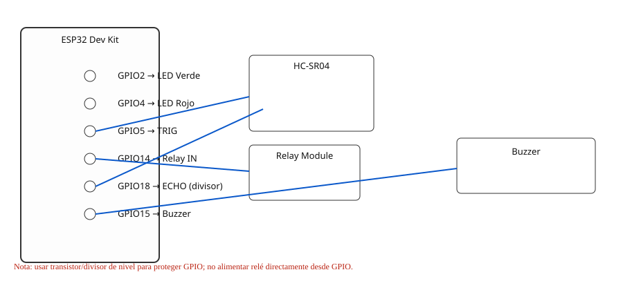

# README - ESP32 Dev Kit — Device_Iot_Arduino

Este README documenta el pinout y recomendaciones para el sketch `Device_Iot_Arduino.ino` (ESP32 Dev Kit).

## Pinout usado en el código

Los pines definidos en `Device_Iot_Arduino.ino` son (números GPIO del ESP32):

- **ledGreen**: `GPIO2`   — LED ok
- **ledRed**: `GPIO4`     — LED deny
- **trigPin**: `GPIO5`    — Trigger del sensor ultrasónico (HC-SR04)
- **echoPin**: `GPIO18`   — Echo del sensor ultrasónico
- **relayPin**: `GPIO14`  — Control del relé
- **buzzerPin**: `GPIO15` — Buzzer / zumbador

> En el código:
>
> ```cpp
> const int ledGreen   = 2;   // LED ok (GPIO 2)
> const int ledRed     = 4;   // LED deny (GPIO 4)
> const int trigPin    = 5;   // Trigger del sensor ultrasónico (GPIO 5)
> const int echoPin    = 18;  // Echo del sensor ultrasónico (GPIO 18)
> const int relayPin   = 14;  // Pin para controlar el relay (GPIO 14)
> const int buzzerPin  = 15;  // Buzzer (GPIO 15)
> ```

## Advertencias y recomendaciones

- Comprueba la documentación de tu placa ESP32 Dev Kit: algunos pines pueden tener funciones especiales (periféricos, strapping, o usados por la flash) en determinados modelos.
- Para el sensor HC-SR04: si alimentas el sensor a 5V, el pin `ECHO` entrega 5V — usa un divisor de tensión o un convertidor de nivel para no aplicar 5V directamente a `GPIO18`.
- El relé y el buzzer normalmente requieren más corriente que la que puede suministrar un GPIO: usa un módulo con driver/optocoplador o controla el relé/buzzer mediante un transistor y una fuente de alimentación externa; comparte GND.
- Evita dejar estados que interfieran con el arranque del ESP32; si ves problemas en el boot, revisa los pines usados y prueba con otros GPIOs (consulta la hoja de tu placa).

## Imagen del pinout (referencia)

Para referencia visual del mapeo de pines del ESP32 Dev Kit (verifica versión de tu placa antes de usar):

<div align="center">
	
</div>

Usa esta referencia para confirmar las funciones y restricciones de los GPIOs en tu placa.

## Diagrama de conexión (rápido)

Conexión simplificada (compartir GND entre ESP32 y módulos):

- `trigPin` (GPIO5) → HC-SR04 TRIG
- `echoPin` (GPIO18) ← HC-SR04 ECHO (usar divisor si sensor a 5V)
- `relayPin` (GPIO14) → Relay IN (módulo con driver)
- `buzzerPin` (GPIO15) → Buzzer (usar transistor si consume >20mA)
- `ledGreen` (GPIO2) → LED con resistencia 220Ω → GND
- `ledRed` (GPIO4) → LED con resistencia 220Ω → GND

Recomendación: conecta primero en protoboard y mide señales antes de alimentar la placa desde fuentes externas.

## Archivo relacionado

- Sketch: `Device_Iot_Arduino.ino` (ubicado en este directorio)


- `wiring.svg` — diagrama visual del conexionado (ESP32, HC-SR04, relay, buzzer, LEDs)
- `fritzing_project/meta.xml`
- `fritzing_project/breadboard.svg`
- `fritzing_project/schematic.svg`
- `fritzing_project/pcb.svg`
- `fritzing_project/parts/README.txt` (instrucciones)

**Vista previa del proyecto Fritzing (Breadboard)**



Descargar proyecto Fritzing editable: [wiring_esp32.fzz](fritzing_project/wiring_esp32.fzz)

Instrucciones rápidas para obtener un `.fzz` editable:

1. Abre Fritzing en tu máquina.
2. Crea un nuevo proyecto o abre `fritzing_project/breadboard.svg` como referencia.
3. Añade las partes reales desde la librería (ESP32, HC-SR04, relay, buzzer, LEDs) y conéctalas.
4. Guarda como `wiring_esp32.fzz` con `File -> Save As...`.


