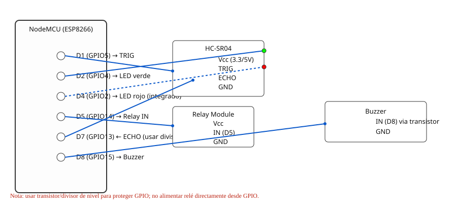

# README - ESP8266 (NodeMCU) — Device_Iot_Arduino

Este README indica el pinout y el cableado usado por el sketch `Device_Iot_Arduino_Esp82.ino` (NodeMCU / ESP8266).

## Pinout usado en el código

Los siguientes pines aparecen en `Device_Iot_Arduino_Esp82.ino` como GPIO (números BCM de ESP8266). También se incluye la referencia física de NodeMCU (Dx):

- **ledGreen**: `GPIO4`  — NodeMCU `D2`  (LED externo sugerido)
- **ledRed**: `GPIO2`    — NodeMCU `D4`  (LED integrado, nota: activo-LOW)
- **trigPin**: `GPIO5`   — NodeMCU `D1`  (Trigger del sensor ultrasónico)
- **echoPin**: `GPIO13`  — NodeMCU `D7`  (Echo del sensor ultrasónico)
- **relayPin**: `GPIO14` — NodeMCU `D5`  (Control del relé)
- **buzzerPin**: `GPIO15`— NodeMCU `D8`  (Buzzer / zumbador)

> Nota: en el código los pines están definidos así:
>
> ```cpp
> const int ledGreen = 4; // GPIO4 (D2)
> const int ledRed = 2;   // GPIO2 (D4) - activo-LOW
> const int trigPin = 5;  // Trigger (D1)
> const int echoPin = 13; // Echo (D7)
> const int relayPin = 14; // Relay (D5)
> const int buzzerPin = 15; // Buzzer (D8)
> ```

## Advertencias y recomendaciones

- `ledRed` está conectado al GPIO2 (LED integrado en muchas placas NodeMCU). En algunas placas este pin puede afectar el arranque si se deja en estado activo; usar con cuidado y comprobar el estado al reset.
- Asegúrate de alimentar correctamente el relé y el buzzer (si requieren más corriente, usar fuente externa y compartir GND).
- El sensor ultrasónico necesita 5V o 3.3V según modelo; usa conversores de nivel si es necesario y comparte GND.

## Imagen del pinout (referencia)

Se añade la URL con una imagen del pinout de NodeMCU V3 para referencia visual:

<div align="center">
	
</div>

Usa esta imagen para verificar las etiquetas Dx ↔ GPIO cuando hagas el cableado.

## Archivo relacionado

- Sketch: `Device_Iot_Arduino_Esp82.ino` (ubicado en este mismo directorio)


## Diagrama de conexión (ASCII) — ejemplo

El siguiente diagrama muestra un ejemplo de conexionado para los componentes usados en el sketch: LED verde, LED rojo (integrado), sensor ultrasónico HC-SR04, relé y buzzer.

Notas generales:
- Comparte GND entre la placa NodeMCU y los módulos externos.
- Usa una fuente externa para el relé o buzzer si requieren más corriente; conecta solamente la señal de control a la GPIO.
- El pin `echoPin` puede requerir un divisor de tensión si el sensor funciona a 5V; evita aplicar 5V directamente al pin del ESP8266.

Ejemplo ASCII (NodeMCU vista simplificada):

	 NodeMCU (lado pines)                  Componentes
	 --------------------                  ----------------
	 [D0] [D1] [D2] [D3] [D4] [D5] [D6] [D7] [D8]
				 |    |    |    |    |    |    |    |
				 |    |    |    |    |    |    |    +-- Buzzer (GPIO15 / D8)
				 |    |    |    |    |    |    +------- (Relay IN) GPIO14 / D5
				 |    |    |    |    |    +------------ (no usado)
				 |    |    |    |    +----------------- LED rojo (GPIO2 / D4) - integrado
				 |    |    |    +---------------------- LED verde (GPIO4 / D2) con R serie
				 |    |    +--------------------------- Trig (GPIO5 / D1) -> HC-SR04 TRIG
				 |    +-------------------------------- Echo (GPIO13 / D7) <- HC-SR04 ECHO

Versión más detallada (con conexiones de alimentación):

	NodeMCU       HC-SR04        Relay Module      Buzzer / LEDs
	-------       -------        ------------      ------------
	3V3  -----+   Vcc (+) 3.3V    Vcc (si 3.3V)     Vcc (si requiere)
	GND  -----+--- GND ---------- GND -------------- GND
	D1 (GPIO5)---- TRIG
	D7 (GPIO13)--- ECHO  (usar divisor si HC-SR04 a 5V)
	D5 (GPIO14)--- IN (Relay)  (si el relé necesita corriente, usar módulo con driver)
	D8 (GPIO15)--- Buzzer (usar transistor si es buzzer activo o pasivo que consume >20mA)
	D2 (GPIO4)---- LED Verde (serie 220Ω) -> LED -> GND
	D4 (GPIO2)---- LED Rojo integrado (activo-LOW en algunas placas)

Recomendaciones prácticas:
- Para el relé: usa un módulo con optoacoplador o un transistor + diodo flyback. No alimentes el relé desde la salida GPIO.
- Para el buzzer: si es pasivo y necesitas más volumen, controla con un transistor (ej. 2N2222) y conecta la alimentación desde Vcc.
- Para HC-SR04 con alimentación a 5V: colocar un divisor en la línea ECHO (por ejemplo 2 resistencias 10k y 20k) para bajar a 3.3V.

Si quieres, puedo generar además un SVG de conexión o un diagrama en formato Fritzing para usar como guía visual. ¿Cuál prefieres (ASCII, SVG, Fritzing)?

He añadido un diagrama SVG con un esquema visual simple en este repositorio:

- `wiring.svg` — diagrama visual del conexionado (NodeMCU, HC-SR04, relay, buzzer, LEDs)
Puedes abrir `wiring.svg` desde tu editor o visualizarlo en un navegador.

**Vista previa del proyecto Fritzing (Breadboard)**



- **Descripción:** Diagrama en vista Breadboard exportado desde Fritzing que muestra el conexionado físico (NodeMCU, HC-SR04, relé, buzzer, LEDs).

- **Archivo recomendado para previsualizar:** coloca la imagen exportada desde Fritzing en `fritzing_project/breadboard.png` o `fritzing_project/breadboard.svg`. Luego incrústala en este README con:

	- PNG: ``
	- SVG: ``

fritzing_project/
│
├── diagrama.fzz
├── fritzing_parts/
│     ├── my_parts.fzbz
│     ├── 1 chan 5v relay module.fzpz
│
├── breadboard.svg
├── breadboard.png
└── README.md

## Partes personalizadas usadas en este proyecto

Este proyecto incluye partes personalizadas necesarias para abrir correctamente el archivo `.fzz` en Fritzing:

- `fritzing_parts/my_parts.fzbz`
- `fritzing_parts/1 chan 5v relay module.fzpz`

Para usarlas en Fritzing:
1. Abrir **Fritzing**
2. Ir a **Window → Parts**
3. Seleccionar **Import…**
4. Elegir los archivos `.fzpz` o `.fzbz`


